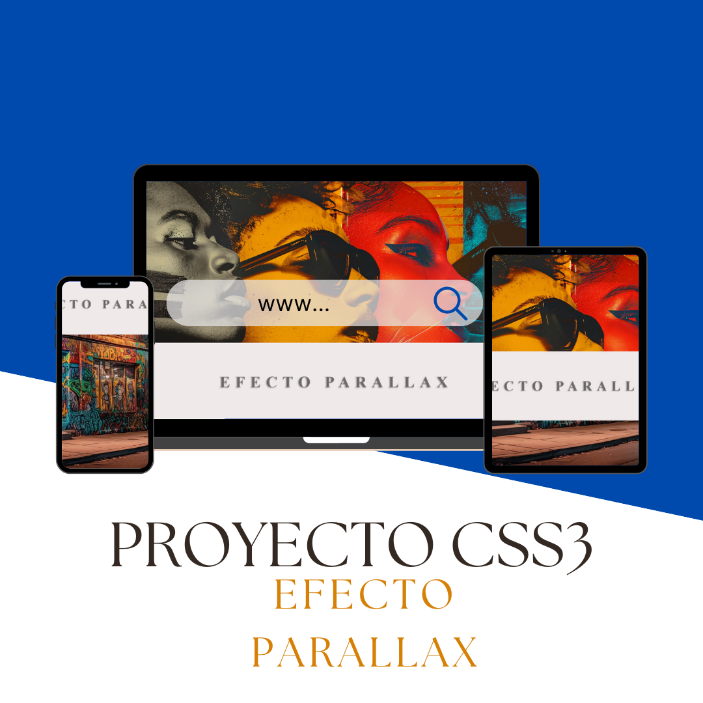
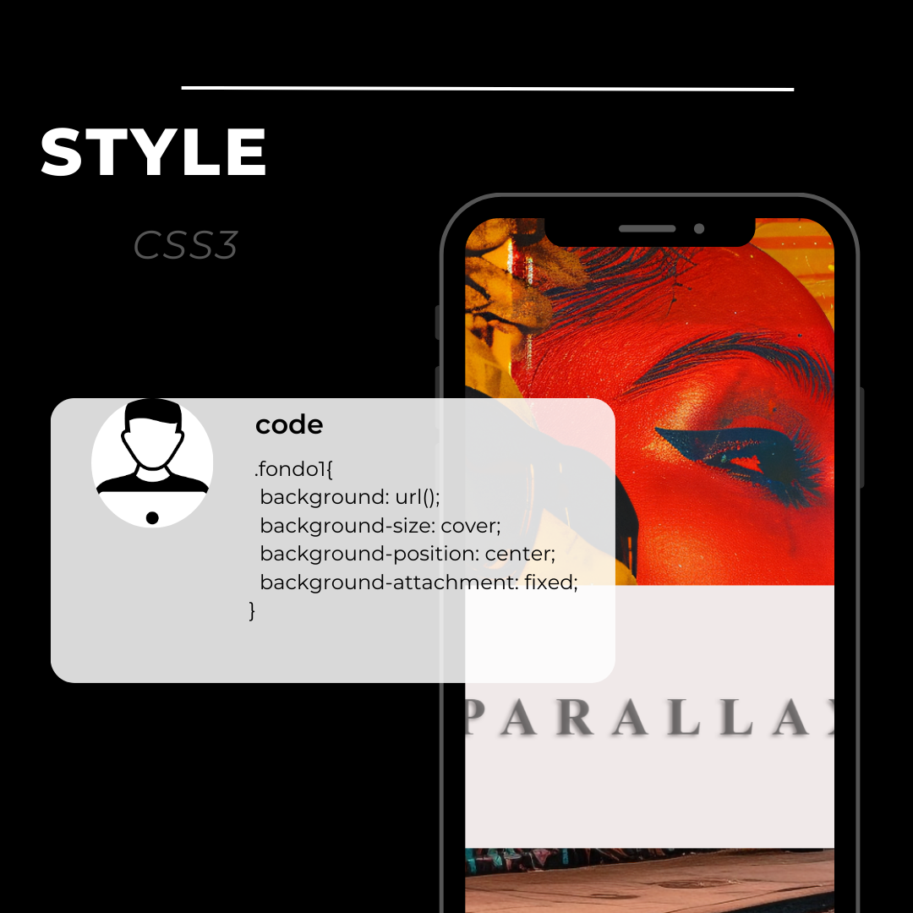

# Efecto Parallax

--

El proyecto Efecto Parallax, es un proyecto realizado con css3, en donde se aplican  diferentes propiedades de fondo como:
- background: url()
- background-size
- background-position:  
- background-attachment: fixed  

Esta práctica consiste en una imagen de fondo  fija  moviéndose con diferente contenido a partir de hacer scrolling en la pagina web.

https://github.com/user-attachments/assets/44ea87c2-3dca-4f64-8aeb-53bd5e12a2a7

### ¿Qué es el efecto parallax?

El efecto parallax es una técnica  de diseño web en la cual usamos diferentes capas o elementos en el sitio web para crear una perspectiva de profundidad y movimiento, lo cual crea una experiencia de usuario dinámica  y atractiva. 

# Tecnologías Usadas

| Tecnologías|  |
| ----------- | ----------- |
|  | CSS3 |
|  | HTML5|
